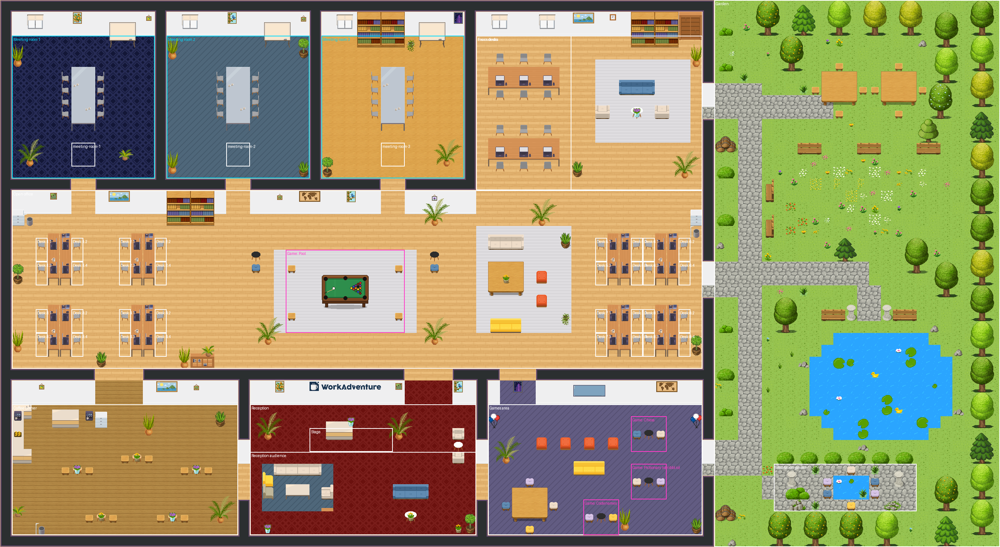

# serve-workadventure

One-command, self-hosted **official [WorkAdventure](https://github.com/workadventure/workadventure)** for a
Raspberry Pi 4 (or any arm64/amd64 Linux box with Docker). You can use all the official tools: the in-browser
map editor, the [map-starter-kit](https://github.com/workadventure/map-starter-kit) and Tiled, the scripting
API and the Room API. Nothing here needs a paid service or account.

The installer runs WorkAdventure's own [`docker-compose.prod.yaml`](https://github.com/workadventure/workadventure/tree/master/contrib/docker)
**exactly as released**. It adds the pieces upstream leaves to you in a separate `deploy/docker-compose.override.yaml`.

| Service | What for | Where from |
|---|---|---|
| traefik, play, back, map-storage, uploader, icon, redis | WorkAdventure itself | official compose file, unmodified |
| authelia | Logins (OpenID Connect): one sign-in covers the game and the chat, and decides who may use the map editor | override |
| synapse | Matrix server for persistent chat, DMs and file uploads | override (same version upstream uses) |
| livekit | Meeting rooms and bubbles with more than 4 people, screen sharing | override (same version upstream uses) |
| coturn | TURN relay so peer-to-peer video works behind strict NATs | override |

## Install on a Raspberry Pi 4

Requirements: **Raspberry Pi OS 64-bit** (Bookworm or newer) and a Pi 4 with 4 GB of RAM or more. Idle memory for
the whole stack is about 1 GB (measured: play 240 MB, back 190 MB, map-storage 165 MB, Synapse 115 MB,
uploader 110 MB, Authelia 60 MB, the rest under 35 MB each). A 2 GB Pi needs extra swap, and the installer tells you how.

```sh
git clone <this repo> serve-workadventure && cd serve-workadventure
./install.sh
```

The installer installs Docker if it is missing, then asks two things:

1. **Domain or IP.**
   - **A domain** (e.g. `office.example.com`, or a free [DuckDNS](https://www.duckdns.org) name) that points at your
     public IP. Forward ports 80 and 443 to the Pi and Traefik gets a Let's Encrypt certificate automatically. This
     is the setup WorkAdventure recommends.
   - **The Pi's LAN IP** (the default when you press Enter). This works only inside your network, as werkadventure
     did. The installer creates a small local certificate authority and **each device must trust
     `deploy/certs/ca.crt` once**. Browsers only allow camera and microphone over trusted HTTPS.
     - Windows: double-click `ca.crt` → Install → Local Machine → "Trusted Root Certification Authorities".
     - macOS: open it in Keychain Access → System → set it to "Always Trust".
     - Android/iOS: install it as a CA certificate (on iOS, also enable it under Settings → General → About →
       Certificate Trust Settings).
     - Firefox on any OS: Settings → Certificates → Import.

     If you skip this, you can click through the warning, but chat and video may not work.
2. **Admin e-mail and password.** This is your login. It can use the map editor.

Non-interactive: `DOMAIN=office.example.com ADMIN_EMAIL=me@example.com ADMIN_PASSWORD='…' ./install.sh -y`

The installer also uploads this repo's office map (`maps/office`, see [Maps](#maps)) and makes it the start room.
Re-running `./install.sh` is safe: it keeps secrets, users and maps.

### Ports

Open these on your router if people join from outside your network:

| Port | For |
|---|---|
| TCP 80, 443 | web (80 for Let's Encrypt and the redirect to https) |
| TCP 7881, UDP 7882 | meetings (LiveKit) |
| TCP+UDP 3478, UDP 49160–49200 | TURN relay for proximity video |
| TCP 50051 | Room API (optional) |

## Everyday use

```sh
bin/wa-user add alice@example.com --name Alice [--editor]   # asks for a password
bin/wa-user list | passwd <email> | delete <email>
bin/wa-user editor <email> on|off                            # map editor permission
scripts/upload-map.sh [--start] [--reset-areas] [folder-or-git-url] [dir]  # publish a map (see below)
scripts/update.sh [v1.x.y]                                    # upgrade WorkAdventure
scripts/backup.sh                                             # backups/<date>.tar.gz
cd deploy && docker compose logs -f play                      # logs
```

Guests can walk in and use proximity video and proximity chat. **Logging in** (top right menu) gives a persistent
name, the Matrix chat (rooms, DMs, history), and the map editor (press `E`) for users with editor permission.

Logging in means entering your e-mail and password on the Authelia page, then clicking **Accept** once. The
official compose file always asks the login provider to re-authenticate (`OPENID_PROMPT=login`), and Authelia
confirms that kind of request with a consent click. The chat then signs in automatically, with no second password.

### Maps

The start room is `maps/office`: a 60×34 office with a garden, built from the official starter kit's art (plus a
pool table drawn by `generate.py`).



| Area | What's there |
|---|---|
| Reception (start) | WorkAdventure logo, reception desk, lounge sofas, plants and art. The **Stage** in front of the desk is an all-hands megaphone: whoever speaks there is heard by everyone standing in the reception rows in front of it. (Only that audience listens: in a listening area WorkAdventure replaces proximity video with "waiting for a speaker".) |
| Coffee corner | Kitchen counter, coffee machines, three café tables with flowers |
| Games area | Big screen with poufs, sofa, board-game table, and three game tables: walk up and press SPACE to open **Chess** (lichess.org), **Pictionary** (skribbl.io) or **Codenames** in a new tab. These are free sites; send colleagues the game link to play together. |
| Open office | 4 desk pods (16 desks, each a claimable personal desk), a lounge corner, and a **pool table**: press SPACE next to it to open 8-ball pool (foony.com, free, no account; "Play with Friends" gives an invite link). |
| Team desks | a long desk (6 desks) in a **silent zone** ("Focus desks"), and a reading corner with bookshelves |
| Meeting rooms 1–3 | Glass table for 8 and a whiteboard, max 8 people. Everyone inside joins one video call (LiveKit). Share a link straight into a room: `https://<domain>/~/office/office.wam#meeting-room-2` |
| Garden | Doors from team desks, the open office and the games area. Picnic tables, a flower meadow, a duck pond and a **meditation garden** (silent zone). Birdsong plays softly (public-domain recording streamed from Wikimedia Commons). |

To change the layout, edit `ROOMS`, `H_WALLS`/`V_WALLS`, `DOORS` and `layout()` in `maps/office/generate.py` and run
`python3 maps/office/generate.py --preview maps/office/preview.png` (needs Python 3 with Pillow for the preview), then
`scripts/upload-map.sh`. Extra tileset images in `maps/office/tilesets/` (the pool table) are added to the starter
kit during the build. The areas (meeting rooms, game links, megaphone, silent zones, desks) are in
`office.wam.template`. They're uploaded only the first time, so later uploads never overwrite changes made with the
in-browser editor. To replace the areas on the server with the template, run `scripts/upload-map.sh --reset-areas`
(this discards map-editor changes to that map).

Other ways to work on maps:

- **In the browser:** log in as an editor and press `E`. You can place furniture, draw areas (meeting rooms with
  LiveKit, silent zones, websites, doors to other maps) and configure the room. Changes are saved to map-storage.
- **With Tiled:** clone the [map-starter-kit](https://github.com/workadventure/map-starter-kit) (it has the
  tilesets), copy `maps/office/office.tmj` into it (or make new maps there) and edit in
  [Tiled](https://www.mapeditor.org). Copy the `.tmj` back to a folder, or publish the whole starter-kit folder:
  `scripts/upload-map.sh <folder or git URL> <directory>`. Open it at `https://<domain>/~/<directory>/<map>.wam`.
  Add `--start` to make it the start room.
- **Map-storage UI:** `https://<domain>/map-storage/` lists your maps. The user and password are
  `MAP_STORAGE_AUTHENTICATION_USER`/`_PASSWORD` in `deploy/.env`. The starter kit's own upload web app can use
  `MAP_STORAGE_AUTHENTICATION_TOKEN` as the API key.

## What is deliberately switched off (paid or third-party)

- **Admin API / SaaS admin** (`ADMIN_API_URL`): WorkAdventure's hosted admin. Not needed. Users and permissions come
  from Authelia and `.env`.
- **Klaxoon**, **Google Drive picker**, **Sentry**: these need accounts with those companies.
- **Jitsi / BigBlueButton**: upstream's defaults point to public third-party servers. Meeting areas use your own
  LiveKit instead.
- **Meeting recording**: needs LiveKit Egress and S3 storage, which is too heavy for a Pi.
- **Telemetry**: off.

Free embeds (YouTube, Excalidraw, tldraw, Google Docs/Sheets/Slides links) stay enabled. They load from those
sites in the visitor's browser.

## How it fits together

```
Browser ──https──► Traefik (official) ─┬─ /            play     (game + WebSocket)
                                       ├─ /api         back
                                       ├─ /map-storage map-storage
                                       ├─ /uploader    uploader
                                       ├─ /icon        icon
                                       ├─ /auth        authelia  ◄── OIDC for play + synapse
                                       ├─ /_matrix     synapse   (chat)
                                       └─ /livekit     livekit   (+ TCP 7881 / UDP 7882 media)
Browser ──TURN (3478)──► coturn (host network)
```

Everything is served on a single host name and routed by path, so a bare LAN IP works as well as a domain.

- `deploy/docker-compose.yaml` and `deploy/.env.template` are downloaded from the pinned WorkAdventure release.
  Never edit them. `scripts/update.sh` replaces them on upgrade and adds any new settings to `.env`.
- `deploy/docker-compose.override.yaml` holds the additions.
- `deploy/templates/` holds the Synapse, Authelia, LiveKit and Traefik configs. They are rendered into
  `deploy/generated/` from `.env`.
- `deploy/.env` is the configuration, including secrets (mode 600). `deploy/data/users.tsv` is the list of logins.
- In LAN mode, `deploy/generated/compose.lan.yaml` adds one Traefik flag, which loads the local certificate as its
  default.

## Upgrading

`scripts/update.sh` shows the latest release and follows upstream's procedure: fetch that release's compose file,
set `VERSION`, recreate. Read the release notes it links to, because some releases need manual steps.

## Troubleshooting

- `cd deploy && docker compose ps`: every service should be `Up`.
- **Login loops or "OpenID" errors**: check `docker compose logs authelia play`. In LAN mode, the device must
  trust `ca.crt`.
- **Chat says it can't connect**: check `docker compose logs synapse`. The bot account is `MATRIX_ADMIN_USER`
  from `.env`, and `./install.sh` recreates it if it is missing.
- **Video only works on the same network**: forward the TURN and LiveKit ports. With a domain, `TURN_EXTERNAL_IP`
  in `.env` must be your public IP.
- **In LAN mode, Traefik logs Let's Encrypt errors for the IP**: this is expected and harmless. It falls back to the
  local certificate.
- **Known upstream issue (v1.33.10):** the browser asks for `/map-storageassets/entities/entities.json`, with a `/`
  missing. `GameScene.ts` joins the `/map-storage` prefix without a slash, while `Room.ts` adds one. On a fresh
  install this is only a console 404. Images uploaded as custom objects in the map editor may not load until it is
  fixed upstream. It affects every install that uses the official compose file with map-storage on a path.

## Licenses

WorkAdventure is AGPL-3.0 with the Commons Clause. Self-hosting it for your own team is fine; selling it as a
hosted service is not. The office map uses the map-starter-kit's tiles, which are CC-BY-SA 3.0 (credit:
WorkAdventure). The map itself is therefore CC-BY-SA 3.0 too.
